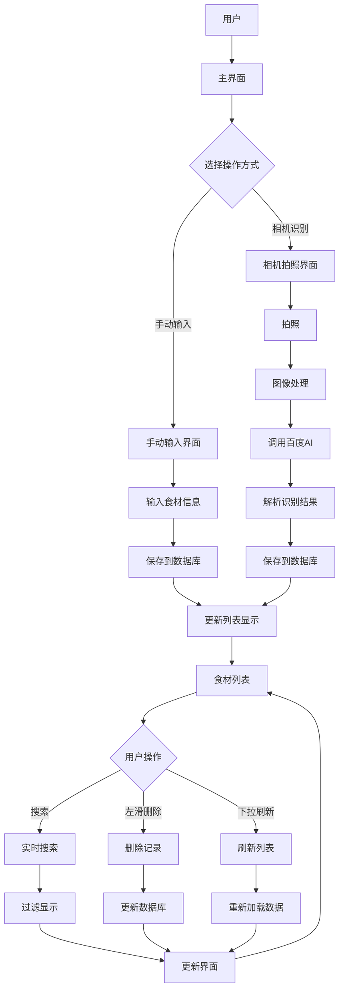

# 食材管理系统业务流程图

## 系统业务流程图

## 业务流程说明

### 1. 用户操作入口
- 用户进入主界面后，可以选择两种操作方式：
  - 手动输入食材信息
  - 使用相机拍照识别食材

### 2. 手动输入流程
- 用户输入食材信息
- 系统保存到数据库
- 更新列表显示

### 3. 相机识别流程
- 用户拍照
- 系统处理图像
- 调用百度AI服务
- 解析识别结果
- 保存到数据库
- 更新列表显示

### 4. 食材列表管理
- 支持实时搜索
- 支持左滑删除
- 支持下拉刷新
- 实时更新界面显示

## 技术实现说明

### 1. 数据存储
- 使用SQLite数据库存储食材信息
- 通过FoodDatabase类管理数据库操作
- 实现CRUD（创建、读取、更新、删除）操作

### 2. 图像处理
- 使用Android相机API拍摄图片
- 图像格式转换和压缩
- Base64编码传输
- 调用百度AI服务进行识别

### 3. 网络通信
- 使用OkHttp处理网络请求
- 实现异步请求机制
- 处理请求结果和错误情况
- 确保数据传输安全性

### 4. 用户界面
- 使用RecyclerView显示列表
- 实现实时搜索功能
- 支持左滑删除操作
- 实现下拉刷新机制 