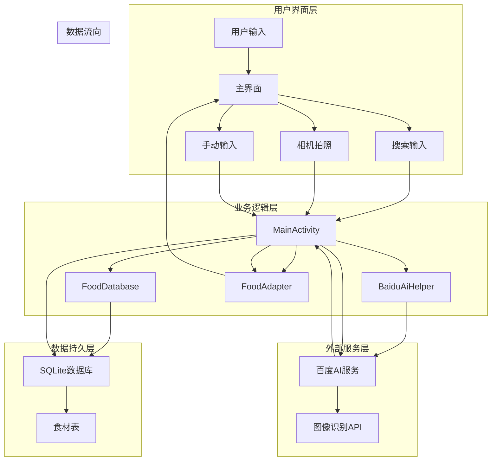

# 食材管理系统数据流图

## 系统数据流图

## 数据流说明

### 1. 数据输入流
- 用户手动输入数据
  - 食材名称
  - 保质期
  - 数量
- 相机拍照数据
  - 图片数据
  - 图像格式
- 搜索输入数据
  - 搜索关键词

### 2. 数据处理流
- MainActivity处理
  - 数据验证
  - 业务逻辑处理
  - 界面更新
- FoodDatabase处理
  - 数据库操作
  - 数据持久化
  - 数据查询
- BaiduAiHelper处理
  - 图像识别
  - API调用
  - 结果解析
- FoodAdapter处理
  - 数据绑定
  - 列表更新
  - 界面刷新

### 3. 数据存储流
- SQLite数据库
  - 表结构
  - 数据记录
  - 查询结果
- 食材表
  - ID字段
  - 名称字段
  - 保质期字段
  - 数量字段

### 4. 数据输出流
- 界面显示
  - 列表数据
  - 搜索结果
  - 识别结果
- 数据反馈
  - 操作结果
  - 错误提示
  - 状态更新

## 数据流特点

### 1. 数据安全性
- 参数化查询防止SQL注入
- 数据加密传输
- 访问权限控制

### 2. 数据实时性
- 实时搜索响应
- 即时界面更新
- 异步数据处理

### 3. 数据一致性
- 事务管理
- 数据同步
- 状态维护

### 4. 数据效率
- 连接池复用
- 缓存机制
- 异步处理 